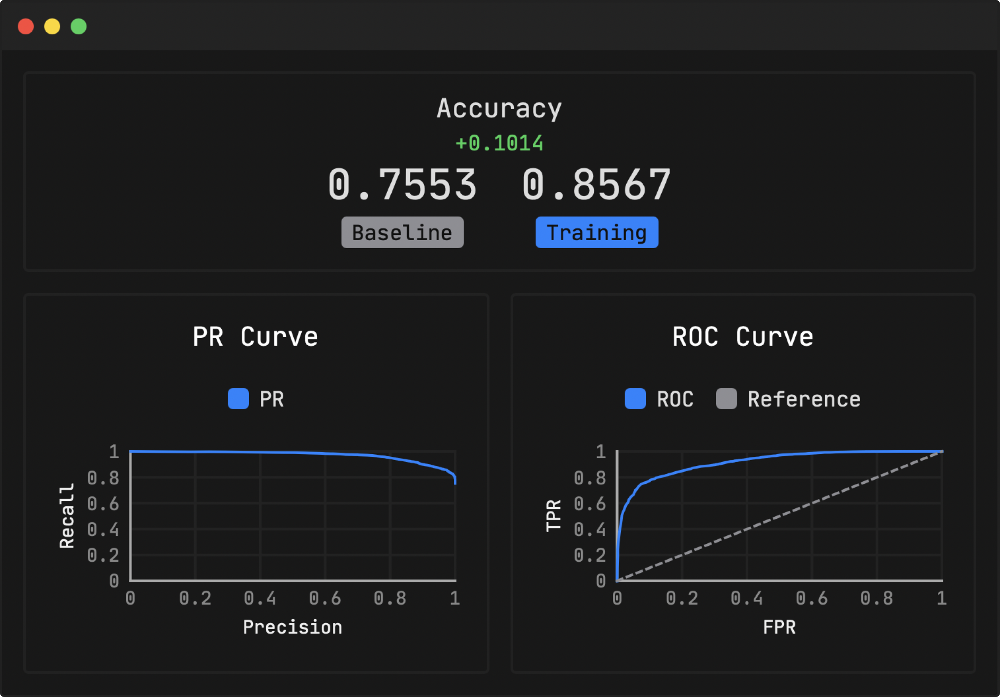
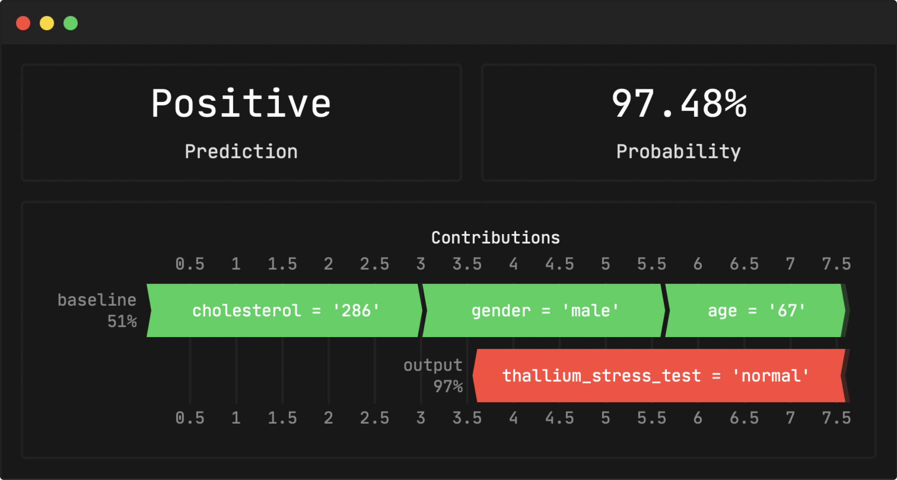
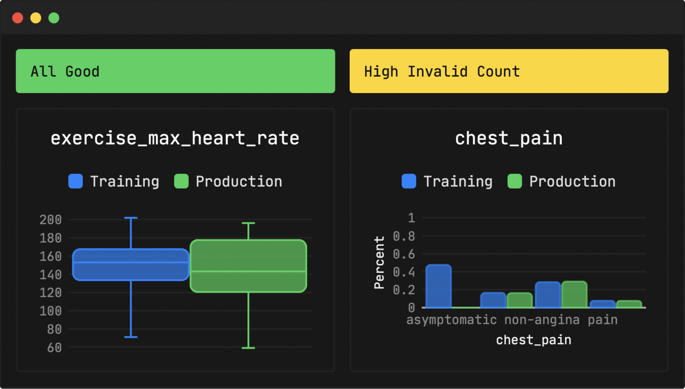
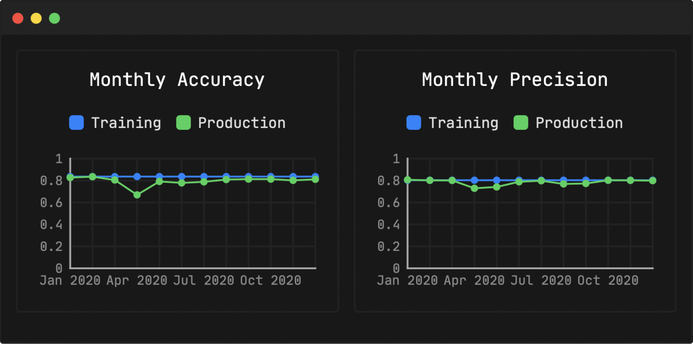

<p align="center">
	
</p>

<h1 align="center">
Tangram is the all-in-one machine learning toolkit for programmers.
</h1>

<p align="center">
Train a model from a CSV file on the command line. Make predictions from Elixir, Go, JavaScript, PHP, Python, Ruby, or Rust. Learn about your models and monitor them in production from your browser.
</p>

<p align="center">
  <a href="https://tangram.dev/docs/">
      
  </a>
  <a href="">
    
  </a>
</p>
<p align="center">
	<a href="https://hex.pm/packages/tangram">
		
	</a>
	<a href="https://github.com/tangramdotdev/tangram-go">
		
	</a>
	<a href="https://www.npmjs.com/package/@tangramdotdev/tangram">
		
	</a>
	<a href = "https://packagist.org/packages/tangram/tangram">
	  
	</a>
	<a href="https://pypi.org/project/tangram/">
		
	</a>
	<a href="https://rubygems.org/gems/tangram">
		
	</a>
	<a href="https://crates.io/crates/tangram">
		
  </a>
</p>

<p align="center">
  <a href="https://twitter.com/intent/follow?screen_name=tangramdotdev">
    
  </a>
</p>

# Tangram

[Website](https://www.tangram.dev) | [Docs](https://www.tangram.dev/docs/) | [Discord](https://discord.gg/jT9ZGp3TK2)

Tangram makes it easy for programmers to train, deploy, and monitor machine learning models.

- Run `tangram train` to train a model from a CSV file on the command line.
- Make predictions with libraries for [Elixir](https://hex.pm/packages/tangram), [Go](https://pkg.go.dev/github.com/tangramdotdev/tangram-go), [JavaScript](https://www.npmjs.com/package/@tangramdotdev/tangram), [PHP](https://packagist.org/packages/tangram/tangram), [Python](https://pypi.org/project/tangram), [Ruby](https://rubygems.org/gems/tangram), and [Rust](lib.rs/tangram).
- Run `tangram app` to learn more about your models and monitor them in production.

### Install

[Install the `tangram` CLI](https://www.tangram.dev/docs/install)

### Train

Train a machine learning model by running `tangram train` with the path to a CSV file and the name of the column you want to predict.

```
$ tangram train --file heart_disease.csv --target diagnosis --output heart_disease.tangram
✅ Loading data.
✅ Computing features.
🚂 Training model 1 of 8.
[==========================================>                         ]
```

The CLI automatically transforms your data into features, trains a number of linear and gradient boosted decision tree models to predict the target column, and writes the best model to a `.tangram` file. If you want more control, you can provide a config file.

### Predict

Make predictions with libraries for [Elixir](https://hex.pm/packages/tangram), [Go](https://pkg.go.dev/github.com/tangramdotdev/tangram-go), [JavaScript](https://www.npmjs.com/package/@tangramdotdev/tangram), [PHP](https://packagist.org/packages/tangram/tangram), [Python](https://pypi.org/project/tangram), [Ruby](https://rubygems.org/gems/tangram), and [Rust](https://lib.rs/tangram).

```javascript
let tangram = require("@tangramdotdev/tangram")

let model = new tangram.Model("./heart_disease.tangram")

let input = {
	age: 63,
	gender: "male",
	// ...
}

let output = model.predict(input)
console.log(output)
```

```javascript
{ className: 'Negative', probability: 0.9381780624389648 }
```

### Inspect

Run `tangram app`, open your browser to http://localhost:8080, and upload the model you trained.

- View stats and metrics.
- Tune your model to get the best performance.
- Make example predictions and get detailed explanations.




### Monitor

Once your model is deployed, make sure that it performs as well in production as it did in training. Opt in to logging by calling `logPrediction`.

```javascript
// Log the prediction.
model.logPrediction({
	identifier: "6c955d4f-be61-4ca7-bba9-8fe32d03f801",
	input,
	options,
	output,
})
```

Later on, if you find out the true value for a prediction, call `logTrueValue`.

```javascript
// Later on, if we get an official diagnosis for the patient, log the true value.
model.logTrueValue({
	identifier: "6c955d4f-be61-4ca7-bba9-8fe32d03f801",
	trueValue: "Positive",
})
```

Now you can:

- Look up any prediction by its identifier and get a detailed explanation.
- Get alerts if your data drifts or metrics dip.
- Track production accuracy, precision, recall, etc.







## Building from Source

This repository is a Cargo workspace, and does not require anything other than the latest stable Rust toolchain to get started with.

1. Install [Rust](rust-lang.org) on Linux, macOS, or Windows.
2. Clone this repo and `cd` into it.
3. Run `cargo run` to run a debug build of the CLI.

If you are working on the app, run `scripts/app/dev`. This rebuilds and reruns the CLI with the `app` subcommand as you make changes.

To install all dependencies necessary to work on the language libraries and build releases, install [Nix](https://nixos.org) with [flake support](https://nixos.wiki/wiki/Flakes), then run `nix develop` or set up [direnv](https://github.com/direnv/direnv).

If you want to submit a pull request, please run `scripts/fmt` and `scripts/check` at the root of the repository to confirm that your changes are formatted correctly and do not have any errors.

## License

All of this repository is MIT licensed, except for the `crates/app` directory, which is source available and free to use for testing, but requires a paid license to use in production. Send us an email at hello@tangram.dev if you are interested in a license.
